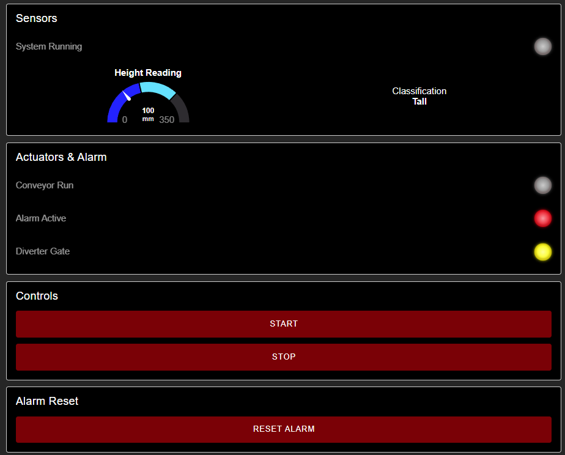
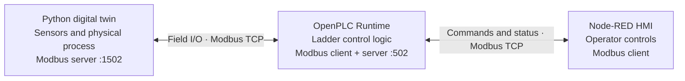
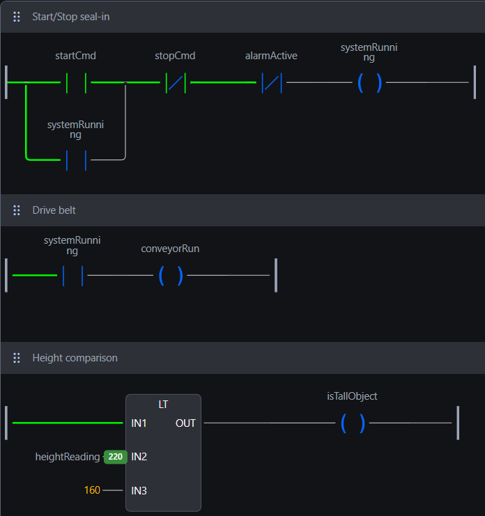
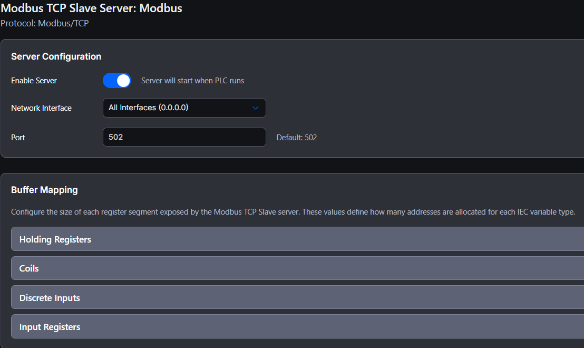
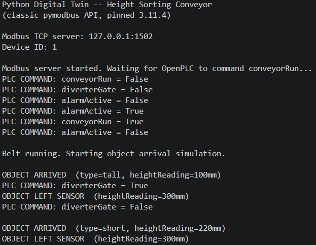

# Height Sorting Conveyor Automation

[](https://github.com/santinograssi/height-sorting-conveyor/actions/workflows/python-tests.yml)

An industrial-automation portfolio project that combines an **OpenPLC controller**, a **Python digital twin**, a **Node-RED HMI**, and two **Modbus TCP** communication links.

The system simulates products moving through a conveyor, measures their height, classifies them, and actuates a diverter for tall products. It also implements start/stop control, jam detection, a latched alarm, and operator reset behavior.



## What this project demonstrates

- PLC programming in Ladder Diagram (LD)
- Start/stop seal-in logic and output interlocking
- Timer-based jam detection and latched alarm handling
- Modbus TCP client/server integration
- Separation between plant simulation and control logic
- Python asynchronous programming and automated tests
- HMI design with live status, controls, height display, and alarms
- Documentation of signal flow, addressing, and startup procedure

## System architecture



The Python application represents the physical conveyor. OpenPLC is the only component that makes control decisions. Node-RED communicates with OpenPLC—not directly with the twin—so the PLC remains the central control and data path, as it would in a real automation system.

## Implementation evidence

The screenshots below show the project components used in the demonstration.

| OpenPLC control logic | OpenPLC Modbus TCP server |
|---|---|
|  |  |



## Control sequence

1. The operator presses **Start** on the Node-RED HMI.
2. OpenPLC latches the running state and commands the conveyor.
3. The Python twin generates a random short or tall product.
4. OpenPLC reads the presence sensor and height value from the twin.
5. A product below the `160 mm` distance threshold is classified as tall.
6. OpenPLC activates the diverter while a tall product is detected.
7. If a product remains at the sensor for eight seconds, the PLC latches a jam alarm and stops the conveyor.
8. The operator must clear the alarm with **Reset Alarm** and press **Start** again.

## Repository structure

```text
height-sorting-conveyor/
├── digital_twin/              Python plant and sensor simulation
│   ├── config.py              Network settings, address map, and timings
│   ├── modbus_server.py       Modbus datastore and TCP server
│   ├── plant.py               Conveyor and product behavior
│   ├── actuator_monitor.py    PLC command and alarm monitoring
│   ├── main.py                Application orchestration
│   └── tests/                 Automated regression tests
├── openPLC/                   OpenPLC project and Ladder program
│   ├── pous/programs/main.ld  PLC control logic
│   └── devices/               Modbus client/server configuration
├── node_red/flows.json        Importable Node-RED Dashboard 2 flow
├── docs/                      Setup and Modbus documentation
├── images/                    Portfolio screenshots
└── README.md
```

## Main Modbus signals

The project uses two separate Modbus servers. An address is only meaningful together with its server, memory type, and port.

### Python digital twin — `127.0.0.1:1502`

| Signal | Memory | Address | Direction | Purpose |
|---|---:|---:|---|---|
| `objectDetected` | Coil | 0 | Twin → OpenPLC | Product presence sensor |
| `heightReading` | Input register | 0 | Twin → OpenPLC | Simulated distance in millimetres |
| `conveyorRun` | Coil | 10 | OpenPLC → Twin | Conveyor motor command |
| `diverterGate` | Coil | 11 | OpenPLC → Twin | Sorting gate command |
| `alarmActive` | Coil | 12 | OpenPLC → Twin | Jam alarm state |

### OpenPLC server — `127.0.0.1:502`

| Signal | Memory | Address | Node-RED use |
|---|---:|---:|---|
| `conveyorRun` | Coil | 0 | Running indication |
| `diverterGate` | Coil | 1 | Diverter indication |
| `alarmActive` | Coil | 2 | Alarm indication |
| `startCmd` | Coil | 3 | Start pushbutton pulse |
| `stopCmd` | Coil | 4 | Stop pushbutton pulse |
| `resetCmd` | Coil | 5 | Alarm reset pulse |
| `systemRunning` | Coil | 6 | Latched machine status |
| `heightReading` | Input register | 0 | Height gauge and classification |

See the [complete Modbus address map](docs/MODBUS_ADDRESS_MAP.md) for function codes, OpenPLC locations, mappings, and end-to-end signal examples.

## Requirements

- Python 3.10 or newer
- OpenPLC Runtime and OpenPLC Editor
- Node.js and Node-RED
- `@flowfuse/node-red-dashboard` version `1.30.2`
- `@flowfuse/node-red-dashboard-2-ui-led` version `1.1.0`
- `node-red-contrib-modbus` version `5.60.1`

All three applications are configured to run on the same Windows computer using `localhost`.

## Quick start

### 1. Prepare the Python digital twin

Open PowerShell in the repository:

```powershell
cd digital_twin
py -m venv .venv
.\.venv\Scripts\Activate.ps1
python -m pip install -r requirements.txt
```

### 2. Load the other components

- Open the project in `openPLC/` with OpenPLC Editor and connect it to OpenPLC Runtime.
- Follow the [Node-RED setup guide](docs/NODE_RED_SETUP.md) and import `node_red/flows.json`.

### 3. Start the system in this order

1. Start the digital twin with `python main.py` from `digital_twin/`.
2. Start OpenPLC Runtime and run the PLC program.
3. Start Node-RED, deploy the imported flow, and open the dashboard.
4. Press **Start** on the HMI.

The twin initially prints `Waiting for OpenPLC to command conveyorRun`. This is expected: the PLC owns the conveyor command.

## Tests

The tests validate the preserved Modbus contract, product cycle, stopped-belt behavior, and PLC command monitoring. They do not require a running PLC or Node-RED instance.

```powershell
cd digital_twin
python -m unittest discover -s tests -v
```

GitHub Actions runs the same tests automatically on every push and pull request.

## Design notes and limitations

- Product arrival and height are simulated rather than connected to physical sensors.
- The twin uses a local Modbus datastore; OpenPLC owns all control decisions.
- Stopping the belt while a product is present freezes the sensor values. This intentionally allows the PLC jam sequence to be demonstrated.
- The project is configured for local demonstration. Network addresses and security settings must be reviewed before using it across machines or on a real industrial network.

## Documentation

- [Python digital twin guide](digital_twin/README.md)
- [Complete Modbus address map](docs/MODBUS_ADDRESS_MAP.md)
- [Node-RED setup](docs/NODE_RED_SETUP.md)
